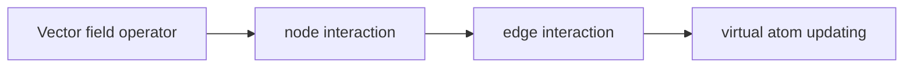

!!! abstract
    There are some keypoints of the vector field networks(i.e VFN).

    * The VFN is en encoder which uses Graph networks to encode the feature of atoms.

    * VFN solved the atom representation bottleneck.

    * Every atom has learnable weiget, so the real atoms can be treated as virtual atoms, which is good to the model performance.

    * No need to use externel knowledge base.

## Previous work
The encoder used in the previous protein design and inversing folding task is IPA eocoder, which is derived from Alphafold.

The main problem of IPA encoder is that it uses pooling operation and the single pooled distance value to represent the atom feature. So that the IPA network cannot provide learnable weights for the coordinates of each atom, facing the **==atom representation bottleneck==**.

## Pipeline of the VFN

## Experiment 
!!! info
    The VFN achieve the SoTA results under the following tasks:
    
    * Pretein Diffusion

        * Diversity

        * Designability

    * Inverse folding 

        * Sequence recovery

        * Structure recovery

        * Speed and accuracy trade-off 